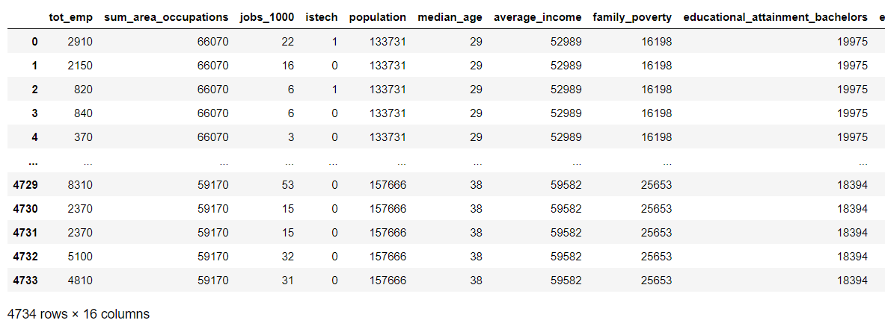
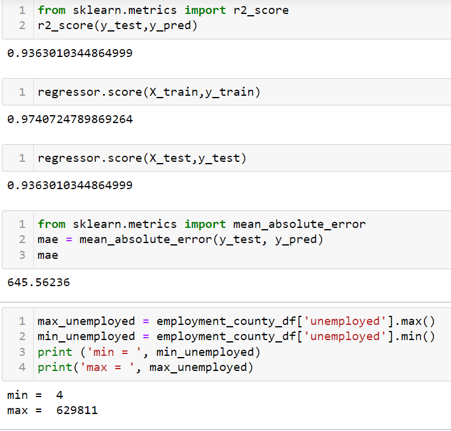
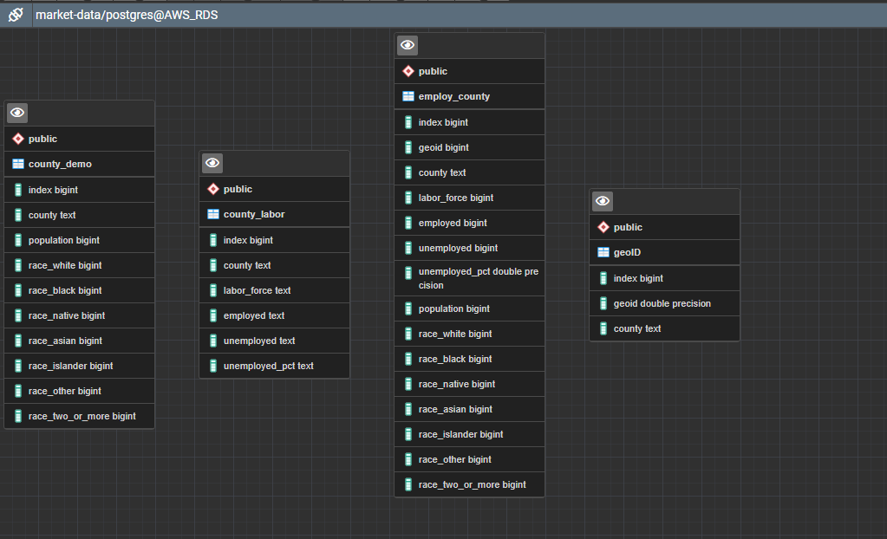

# University of Arizona Data analytics Boot-camp - Final_project
## Capstone Analysis

# Analyzing concentration of occupation based on location in USA

**Overview of the analysis:**

In this final project our team has decided to analyze unemployment data in US states and counties, we wanted to see which states and counties has most unemployment rate. Question we hope to answer is which state/county has the most unemployed population, with the given features in the data-set can we predict the unemployment for those states and counties.

The BLS data show that the nation's three largest cities have unemployment rates dramatically higher than the national average of 5.9 percent in June 2021, with Los Angeles and New York at 10.6 percent and Chicago at 8.2 percent.Reason we choose this topic is our curiosity about the “great resignation” , and what percentage of labor force is actually unemployed and not contributing to the countries economy.

Overall outline of this analysis is getting employment and demographic data, Merge and clean the data,upload the clean data in to a database and create a machine model , visualizations and interactive elements.

**Developers**

- Ken Paulson
- Khanh Ngo
- Sangeetha Venu Gopalan

**Git-hub and general communication:**

Team members are assigned specific roles each week in this project, we all work together on all parts of the project. we meet via zoom twice a week on Tuesdays and Thursdays (6 or 6.30pm ) to discuss ideas and responsibilities. We use slack every day to communicate ideas and changes made to repository.In our team to avoid git issues we work on our separate branch after we merge the branch to main we delete the branch from the repository.

**Data-exploration and analysis:** 

Data exploration is the first step of data analysis used to explore and visualize data to uncover insights from the start or identify areas or patterns to dig into more. After cleaning and uploading the data in to our database, we have spent some time to explore the data , to decide whether there is any trend in the data ,what analysis will answer our question better , what story we can tell with the dataset, Using pandas and matplotlib we analyzed the dataset, we started to see a trend the counties with most population also have more unemployment rates.Our data exploration and analysis are in the files "Employment_by_County notebook" and "Charts_from_Employment_by_County"

**Data Source:**

We have downloaded employment data from bls.gov.Link given below 

https://www.bls.gov/lau/#cntyaa

**Machine Learning:** 

Data preprocessing improves the data quality by cleaning, normalizing, transforming and extracting relevant feature from raw data. Our raw data came in with columns with data type objects, the machine model we have built can only take in columns with numbers, we have formatted the dataframe “features” in to integer columns, remove null/missing values.

Feature engineering and preliminary feature selection: We have initially tried linear regression and we did not get great results , after our team discussion we have come up with random forest regressor model because this technique that combines predictions from multiple machine learning algorithms to make a more accurate prediction than a single model ,then we decided our features and tested how weight of each feature affected the predictions, then we split the data into training and testing 80-20, we have got the very good accuracy score.

**Database:** 

We have set up the database that will connect to AWS with our data. We have created tables in postgres to load the dataframes, we used join using SQL and create a new combined data that has the geoid that can be used to train and test the machine model.

**Dashboard** 

We are building a google slides, to create an initial dashboard , for our final visual presentation we have decided to used tableau dash boards and a web page that will show the interactive element of our charts and the analysis prediction by our machine model.

[Dashboard 1](https://public.tableau.com/app/profile/sangeetha.venu.gopalan/viz/Final_project_stateoverview_db/State_overview_db?publish=yes)
[Dashboard 2](https://public.tableau.com/app/profile/sangeetha.venu.gopalan/viz/Final_project_county_db/county_overview_db?publish=yes)
[Dashboard 3](https://public.tableau.com/app/profile/sangeetha.venu.gopalan/viz/Final_project_top_unemp_db/state_county_top_unemployed_db?publish=yes)
[Dashboard 4](https://public.tableau.com/app/profile/sangeetha.venu.gopalan/viz/Final_project_Race_map/race_pop?publish=yes)

**Result:**

**Recommendation for future analysis:**

**Technologies and tools used for this analysis:**