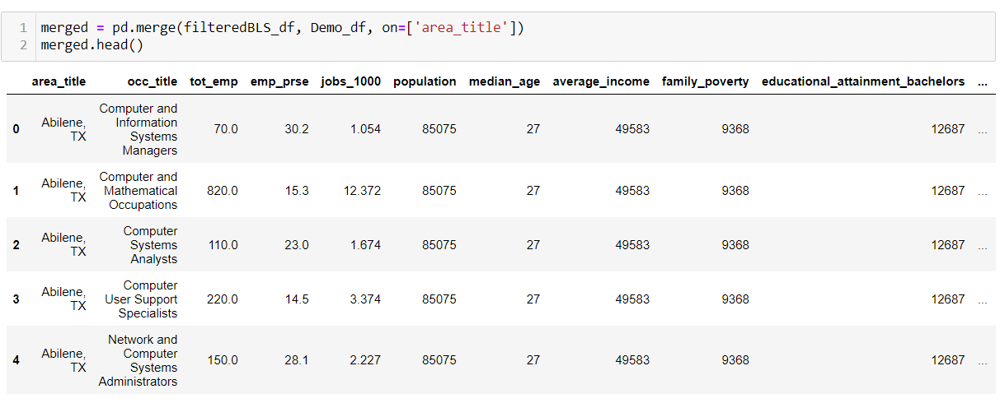

# University of Arizona Data analytics Boot-camp - Final_project
## Capstone Analysis

# Analyzing concentration of occupation based on location in USA

**Overview of the analysis:**

In this final project our team has decided to analyze occupation based on demographic information, we are trying to understand if there is a trend or correlation in a certain type of occupation vs location (for example: which city or state offers more technical jobs, is technical jobs increasing in Colorado?  Or Arizona). Question we hope to answer is there a relationship between demography and Job type, which city/state offer more Technical/Data jobs.

Reason we choose this topic is our curiosity to find which city or state has most tech/data jobs, now most tech jobs can be performed remotely, applying in multiple states which offers more jobs increases our probability of getting the job we desire faster.

**Developers**

- Ken Paulson
- Khanh Ngo
- Sangeetha Venu Gopalan

Team members are assigned specific roles every week in this project, we all work together on each part of the project. 

Communication protocols: We meet via zoom twice a week on Tuesdays and Thursdays to discuss ideas and responsibilities. We use slack every day to communicate changes made to repository.To avoid git issues we work on our branch and delete the branch from the repository.

**Week 1 deliverable:**

Data Source : We have downloaded employment data for May 2018 ,2019, 2020, we cleaned and combined the data into one CSV file(all ETL code is in the ETL_code folder), then used the combined dataframe to map, zip code and locations from a private database. we have our sample dataframe which we will use to train our machine model.

https://www.bls.gov/oes/tables.htm

https://www.cubitplanning.com

Machine Learning : We have created our machine learning model that will take the sample data. 

Database : We have set up the database that will connect to AWS via postgres to show sample data.
