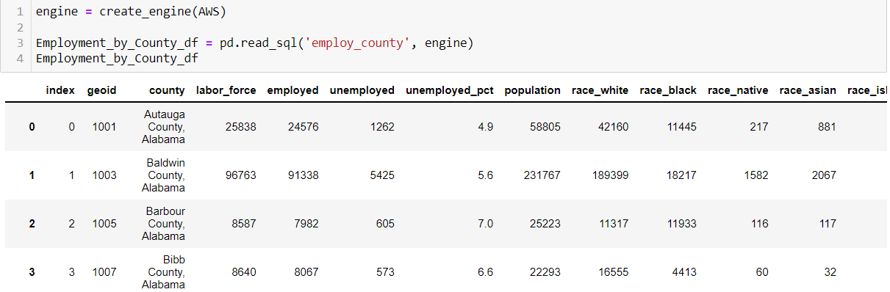

# University of Arizona Data analytics Boot-camp - Final_project
## Capstone Analysis

# Analyzing concentration of occupation based on location in USA

**Overview of the analysis:**

In this final project our team has decided to analyze unemployment data in US states and counties, we wanted to see which states and counties has most unemployment rate. Question we hope to answer is 'which state/county has the most unemployed population', with the given features in the data-set can we predict the unemployment for those states and counties.

The BLS data show that the nation's three largest cities LA, New York and Chicago have unemployment rates dramatically higher than the national average of 5.9 percent in last year. Reason we choose this topic is our curiosity about the “great resignation”, and what percentage of labor force is actually unemployed and not contributing to the country’s economy.

Overall outline of this analysis is getting employment and demographic data, and education data, clean ,merge and upload the data into a database and create a machine model, visualizations and interactive maps to see the results.

**Developers**

- Ken Paulson
- Khanh Ngo
- Sangeetha Venu Gopalan

**Git-hub and team communication:**

Team members are assigned specific roles each week in this project, we all work together on all parts of the project. we meet via zoom twice a week on Tuesdays and Thursdays (6 or 6.30pm Arizona time ) to discuss ideas and responsibilities. We use slack every day to communicate ideas and changes made to repository.In our team to avoid git issues we work on our individual branch after we merge the branch to main we delete the branch from the repository.

**Data-exploration and analysis:** 

Data exploration is the first step of data analysis used to explore and visualize data to uncover insights from the start or identify areas or patterns to dig into. After cleaning and uploading the data in to our database, we have spent some time to explore the data , to decide whether there is any trend in the data ,what analysis will answer our question better , what story we can tell with the dataset, Using pandas and matplotlib we analyzed the dataset, we started to see a trend the counties with most population also have more unemployment rates.Our data exploration and analysis are in the files "Employment_by_County notebook" and "Charts_from_Employment_by_County".

Then we wanted to see if education levels impact higher unemployment rates , we have downloaded county wise education data, and built a tableau chart to see relationship between population, education and unemployment.  

**Data Source:**

We have downloaded all relevant data from the below pages.

https://www.bls.gov/lau/#cntyaa

https://data.census.gov/

**Machine Learning:** 

Data preprocessing improves the data quality by cleaning, normalizing, transforming and extracting relevant feature from raw data. Our raw data came in with columns with data type objects, the machine model we have built can only take in columns with numbers, we have formatted the dataframe “features” into integer columns, dropped unwanted columns, remove null/missing values.

Feature engineering is the process of selecting, manipulating, and transforming raw data into features that can be used in supervised learning. In order to make our model work well, we have discussed which features should be included and which one should be dropped.To get more truer predictions the features should be picked carefully , However in our dataset unemployment will be more where there are more population, so we decided to add education information as a feature , then we used race information , education information to predict unemployed count for the county.

If the model does not perform well on the unseen dataset(test) ,but gives a high score on the seen dataset , the model is overfitting, our test score is 93% ,so our random regressor model is performing well and not overfitting.

**Database:** 

We have set up the database that will connect to AWS , database connects to the model as well. We have created tables in postgres to load the dataframes, we used join using SQL (see database folder) and created a new combined data that has the geoid that can be used to create maps for each counties. 

**Dashboard** 

We are building a google slides, to create an initial dashboard , for our final visual presentation we have decided to used tableau dashboards and a web page that will show the interactive element of our charts , analysis and prediction by our machine model.

[State DB ](https://public.tableau.com/app/profile/sangeetha.venu.gopalan/viz/Final_project_stateoverview_db/State_overview_db?publish=yes)

[County DB ](https://public.tableau.com/app/profile/sangeetha.venu.gopalan/viz/Final_project_county_db/county_overview_db?publish=yes)

[Top DB ](https://public.tableau.com/app/profile/sangeetha.venu.gopalan/viz/Final_project_top_unemp_db/state_county_top_unemployed_db?publish=yes)

[Race1 DB ](https://public.tableau.com/app/profile/sangeetha.venu.gopalan/viz/Final_project_Race_map/race_pop?publish=yes)

[population DB ](https://public.tableau.com/app/profile/kenneth.paulson/viz/Demograpic_County/Dashboard1)

[Race2 DB ](https://public.tableau.com/app/profile/kenneth.paulson/viz/PercentagePopulationbyDemographic/Dashboard2)

[Education_state DB ](https://public.tableau.com/app/profile/sangeetha.venu.gopalan/viz/Final_project_edu_state/education_unemp?publish=yes)

[Education_county DB](https://public.tableau.com/app/profile/sangeetha.venu.gopalan/viz/Final_project_edu_county/education_state_county?publish=yes)

**Results:**

Our model predicts countywise unemployement total using the features in our dataset , model predicts with 93 to 95% accuracy (we have 2 sets of X), we decided to host our webpage in heroku cloud application, please click on the link below to see that in action.

[heroku_link](https://uofa-project.herokuapp.com)

[google slides](https://docs.google.com/presentation/d/1vhAENddHRfgTb4mEkrhFVYieG4LQkvR6Cyb3pK8beMo/edit#slide=id.p)

**Recommendation for future analysis:**

We could improve this analysis by looking deep into the reasons for the high unemployement rates in those counties and exploring data to support that. If we had more time we were planning to do a race based unemployement analysis , to do that we need additional race base data that was not readily available.

**Technologies and tools used for this analysis:**

Languages : Python,Html,Javascript,css.
Tools : Tableau and Google slides.