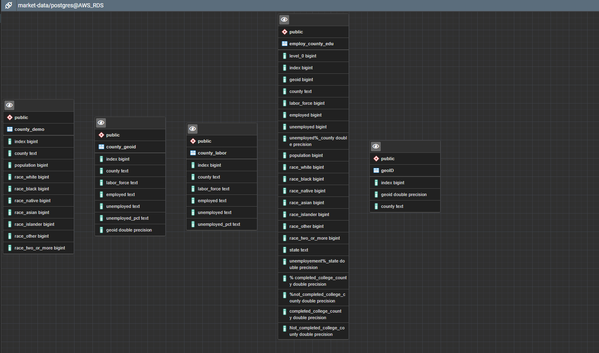

# University of Arizona Data analytics Boot-camp - Final_project
## Capstone Analysis

# Analyzing concentration of Unemployment in US states and counties

**Overview of the analysis:**

In this final project our team has decided to analyze unemployment data in US states and counties. We wanted to see which states and counties has the most unemployment rate. Questions we hope to answer is 'which state/county has the most unemployed population', with the given features in the dataset can we predict the unemployment for those states and counties.

The BLS data show that the nation's three largest cities LA, New York and Chicago have unemployment rates dramatically higher than the national average of 5.9 percent in last year. Reason we choose this topic is our curiosity about the “great resignation”, and what percentage of labor force is actually unemployed and not contributing to the country’s economy.

Overall outline of this analysis is getting employment, demographic data and education data, clean, merge and upload the data into a database and create a machine model, visualizations and interactive maps to see the results.

**Developers**

- Ken Paulson
- Khanh Ngo
- Sangeetha Venu Gopalan

**Git-hub and team communication:**

Team members were assigned to specific roles each week in this project, while we all worked together on all parts of the project.  We meet via zoom twice a week on Tuesdays and Thursdays (6 or 6.30pm Arizona time) to discuss ideas and responsibilities. We used slack every day to communicate ideas and make changes to repository.  To avoid issues with git, we decided to work on our individual branch after we merge the branch to main, then delete the branch from the repository after the merge of the new code.

**Data-exploration and analysis:** 

Initially we wanted to predict state/county which offers the most technical jobs.  We pulled some data from Bureau of Labor Statistics (BLS), and then spent most of our first week in finding data and cleaning the data.  The ETL process code is located in the ETL folder.  As we progress with our topic, we realized the data we found did not have a geoid that will not work for county based analysis.  Another challenge was the initial dataset had no suitable predictors we could use, and the features did not work well with linear regressor model we had built.  So, the team decided to look for new data and in the second week, we changed directions and we found data on countywide unemployment, and we decided to predict unemployment based on race populations and education features.   

Data exploration is the first step of data analysis and used python to explore and visualize data to uncover insights from the start or identify areas or patterns to research. After cleaning and uploading the data in to our database, we spent time exploring the data, and decide whether there is a trend in the data, what analysis will answer our question better, and what story can be told with the updated dataset. 

Using pandas matplotlib we analyzed the dataset, we started to see a trend that counties with most population also have higher unemployment rates.  Our data exploration and analysis are in the charts folder above.

Then we wanted to see if education levels impact higher unemployment rates, we have downloaded county education data, and built a tableau chart to see relationship between population, education and unemployment.    

**Data Source:**

We have downloaded all relevant data from the below pages in excel and then transformed the data to create a csv file. 

https://www.bls.gov

https://data.census.gov

**Machine Learning:** 

Data preprocessing improves the data quality by cleaning, normalizing, transforming, and extracting relevant feature from the data. Our data came in with columns with data type as objects, the machine model we have built can only take in columns with numbers, we have formatted the data frame “features” into integer columns, dropped unwanted columns, before remove null or missing values.

Initially we tried linear regressor and we did not get a decent accuracy score, then we decided to use a random forest regressor model, Random Forest Regression algorithms are a class of Machine Learning algorithms.  The combination of multiple random decision trees, each trained on a subset of data. The use of multiple trees gives stability to the algorithm and reduces variance. we used train_test_spilt() and split our data into 80-20.  The data contained 3200 record used in the training and testing of the model. 

Feature engineering is the process of selecting, manipulating, and transforming raw data into features that can be used in supervised learning. To get accurate predictions, the features needed to be picked carefully. However, in our dataset, unemployment was weighing more than the other features, so we decided to add more feature to see whether that improves our model prediction.
To make our model work better, we have discussed which features should be included and which ones should be dropped. Initially we tried predicting the unemployment percentage we did not get good results.  Then we decide to predict unemployment in each county.  Then we realized its best to use features that are not directly related to unemployment like unemployment percentage for county in our X.

We have learnt that population is weighing more than the other features, so tried to create a balance in feature importance, so we dropped population and used race-based population because of the even distribution of weight, we added feature like education to see if college education impacted unemployment in anyway.

Then we trained and tested our random forest regressor and got an R squared value of 93%, If the model does not perform well on the unseen dataset(test) ,but gives a high score on the seen dataset , the model is overfitting, looking at the scores below we can say our model is not overfitting.

**Database:** 

We have set up the database that in a AWS cloud environment, and the model pulls data from the database. We have created tables in Postgres to load the dataframes, we used join using SQL and created a new combined data that has the geoid and education information for each county that can be used to create maps and charts. 

**Dashboard** 

Google slides were created and tableau charts and dashboards including maps and bar charts.  For our final presentation we have decided to use a webpage that will show the interactive element of our charts , dashboards , and results of our machine model prediction.

[State DB ](https://public.tableau.com/app/profile/sangeetha.venu.gopalan/viz/Final_project_stateoverview_db/State_overview_db?publish=yes)

[County DB ](https://public.tableau.com/app/profile/sangeetha.venu.gopalan/viz/Final_project_county_db/county_overview_db?publish=yes)

[Top DB ](https://public.tableau.com/app/profile/sangeetha.venu.gopalan/viz/Final_project_top_unemp_db/state_county_top_unemployed_db?publish=yes)

[Race1 DB ](https://public.tableau.com/app/profile/sangeetha.venu.gopalan/viz/Final_project_Race_map/race_pop?publish=yes)

[population DB ](https://public.tableau.com/app/profile/kenneth.paulson/viz/Demograpic_County/Dashboard1)

[Race2 DB ](https://public.tableau.com/app/profile/kenneth.paulson/viz/PercentagePopulationbyDemographic/Dashboard2)

[Education_state DB ](https://public.tableau.com/app/profile/sangeetha.venu.gopalan/viz/Final_project_edu_state/education_unemp?publish=yes)

[Education_county DB](https://public.tableau.com/app/profile/sangeetha.venu.gopalan/viz/Final_project_edu_county/education_state_county?publish=yes)

[college unemployment state](https://public.tableau.com/app/profile/sangeetha.venu.gopalan/viz/Final_project_college_unemp_state/high_college_state?publish=yes)

[google slides](https://docs.google.com/presentation/d/1vhAENddHRfgTb4mEkrhFVYieG4LQkvR6Cyb3pK8beMo/edit?usp=sharing)

**Results:**

Our model predicts county unemployment total using the features in our dataset.  The model predicts with 93% accuracy, we decided to host our webpage in Heroku cloud application, please click on the link below to see that in action.

[heroku_link](https://uofa-project.herokuapp.com)

**Recommendation for future analysis:**

We could improve this analysis by looking deep into the reasons for the high unemployment rates in those counties and exploring data to support that, for example adding average household income for each geoid and adding poverty percentage for these counties. we could also include race-based unemployment analysis as well.  Finding and using different data sets was time consuming but should be considered for future analysis. 

**Technologies and tools used for this analysis:**

Languages: Python, html, JavaScript, CSS.

Database: Postgres, AWS.

Tools: Tableau and Google slides.
